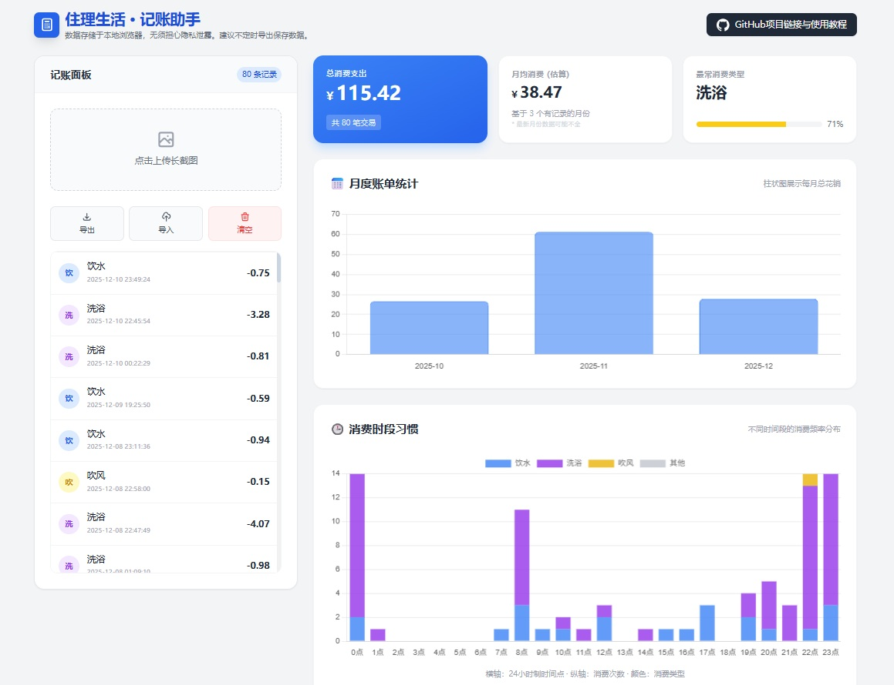

# 住理生活 · 记账助手 📊

一个基于浏览器的本地记账分析工具，专门为“住理生活”App 用户设计。通过 OCR（光学字符识别）技术自动识别消费长截图，并生成多维度的统计图表，帮助你轻松掌握消费习惯。

## ✨ 功能特性

-   **OCR 自动识别**：支持批量上传“住理生活”App 的消费记录长截图，自动提取时间、类型和金额。
-   **隐私安全**：所有图片处理和数据存储均在本地浏览器完成，不上传任何服务器，保护个人隐私。
-   **多维统计**：
    -   **月度趋势**：直观展示每月总花销。
    -   **时段分析**：通过堆叠柱状图分析不同时间段（0-23点）的消费频率。
    -   **消费偏好**：自动计算最高频的消费类型。
-   **数据管理**：支持导出 JSON 备份和 CSV 表格，方便在 Excel 中进一步分析。

## 🚀 使用教程

### 第一步：获取截图
1.  打开 **“住理生活”** App。
2.  进入 **“消费记录”** 页面，选择 **“消费”** 选项卡。
3.  使用手机的 **“截长图”** 功能，截取包含多条记录的完整列表。

### 第二步：上传识别
1.  访问本项目页面 [index.html](index.html)。
2.  在左侧“记账面板”点击上传区域。
3.  选择你截取的长图（示例参考：[image/1.jpg](image/1.jpg)）。
4.  等待 OCR 识别完成（进度条达到 100%），数据将自动存入本地。

### 第三步：查看分析
-   识别完成后，右侧统计面板将自动刷新。
-   你可以查看月度账单统计和消费时段习惯。

## 🛠️ 技术栈

-   **样式**: [TailwindCSS](https://tailwindcss.com/)
-   **逻辑**: [Alpine.js](https://alpinejs.dev/)
-   **识别**: [Tesseract.js](https://tesseract.projectnaptha.com/)
-   **图表**: [Chart.js](https://www.chartjs.org/)

## 💾 数据备份

建议定期使用“导出”功能保存数据。
-   **JSON 备份**：用于日后重新导入本项目。
-   **CSV 表格**：用于在 Excel 或 Google Sheets 中查看。
